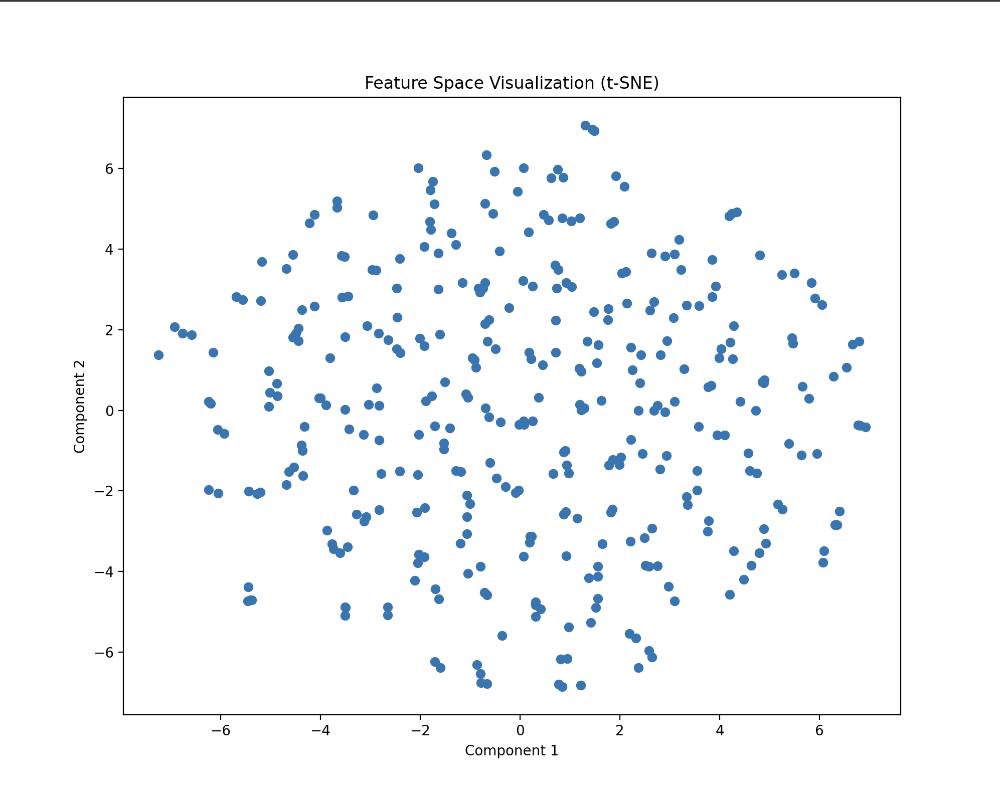

# A Python project applying a Restricted Boltzmann Machine (RBM) structure using [Genomic data](https://www.internationalgenome.org) to create a simple neural network that tracks or predicts disease susceptibility.

**Project Progress:**
1. July 19, 2024: Using the [book](http://www.inference.org.uk/itprnn/book.pdf) *Information Theory, Inference, and Learning Algorithms* by David J.C. MacKay, I am learning about the complex mathematics and logic that goes into Neural Networks (especially with Chapter 40). With this information, I am also solving some of the exercises from the book (42.5 and 42.8 are shown in the  exercises folder in this repository). 
2. July 24, 2024: For exercise 42.5, I edited the visual format to reproduce Figure 42.3 and the DJCM visual. I also ensured that the recall was asynchronous as opposed to synchronous to guarantee the decrease of the Liapunov function. I also added exercise 39.5 (The Noisy LED), which is about calculating the probabilities of different characters being displayed on a noisy 7-segment LED display, given the current state of the display elements and a predefined flipping probability. My output for this exercise does not mimic a 7-segment LED, but perhaps future modifications will change this.
3. July 29, 2024: I start the main project using the prior exercises and the book as a foundation. I begin with researching for Genomic data that is in a format that can easily be handled by a RBM. I find [this](http://ftp.1000genomes.ebi.ac.uk/vol1/ftp/data_collections/1000G_2504_high_coverage_SV/working/20190825_Yale_cnvnator/) from the [1000 Genomes Project](https://www.internationalgenome.org). Once I have the data, I must preprocess it. I do so by "binarizing" the data by setting a threshold by which the data is transformed into a 1 or 0. With this binary format, the data is then ready to be processed by the RBM. I created a RBM class that is trained with a simple Hebbian Learning rule (42.1 in the book). I also have simple metrics printed out after training and error-correcting. 
4. August 4, 2024: I have added extractions to the code, making it possible to visual the data. Specifically, I used t-SNE reduction to reduce the multi-dimensional data into a nice 2D plot. I also expand on my work in essay format, which can be found below.

**Project Essay:**

In this project, I dove into the world of Restricted Boltzmann Machines (RBMs) with guidance from David MacKay's Information Theory, Inference, and Learning Algorithms and insights from Professor VanValkenburgh. RBMs are a type of stochastic neural network that are particularly powerful in unsupervised learning tasks, especially when dealing with complex, high-dimensional data such as genomic data. My main goal was to leverage the theories from the book and build an effective model for unsupervised learning. I started by processing data from a VCF file, which is a standard format for storing genomic data, and converting it into a binary format that the RBM could handle. This involved selecting numeric data, filling in missing values, and binarizing everything to align with the RBM's requirement for binary inputs. This step was crucial for ensuring that the RBM could learn patterns effectively.

The RBM I built has visible and hidden units with weights initialized randomly and biases set to zero. At the core of the RBM is the idea of minimizing energy to learn dependencies between variables. The model works by reducing the energy of configurations that represent the data accurately and increasing it for those that don't. This energy-based approach allows the RBM to discover complex patterns and dependencies within the data that are not immediately obvious. The energy function is central to the RBM's operation and is defined as:

This equation shows how the energy E(v,h) is computed using the visible units, v, hidden units, h, weight matrix, W, and the biases, b and c. 
The energy function is then used to derive the probability distributions over the visible and hidden states, with the partition function playing a major role in normalizing these distributions.

For training, I used the Contrastive Divergence (CD) algorithm, which approximates the gradient of the log-likelihood and updates the weights by comparing the positive and negative phase interactions. The weight update rule can be described by the following equation:

This process, a form of Hebbian learning, strengthens connections between frequently co-activated units, embodying the principle that "neurons that fire together, wire together." The positive phase involves correlating the observed data with the hidden units, while the negative phase reconstructs the data from the hidden layer. The difference between these two phases updates the weights, guiding the RBM to capture the data's underlying structure effectively.

The sigmoid function played a huge role here, helping me compute activation probabilities so the RBM could sample hidden and visible states. The sigmoid function is given by:

$$ \sigma(x) = \frac{1}{1 + e^{-x}} $$

The sigmoid function introduces non-linearity into the model, which is essential for learning complex relationships. It maps the weighted sum of inputs to a probability between 0 and 1, enabling probabilistic inference in the network. This capability is crucial for modeling the stochastic nature of genomic data, which often involves randomness and uncertainty.

After training, I introduced feature extraction and visualization techniques to get a better grasp of the learned representations. Feature extraction involved transforming input data into hidden layer activations, providing a compact representation of the data. These features represent a compressed form of the original data, where each hidden unit activation reflects a specific pattern or trait that the RBM has learned.

To visualize these features, I employed t-SNE, a machine learning tool for reducing dimensionality while preserving local structures. t-SNE maps high-dimensional data into two dimensions, which allows us to visualize complex datasets and identify clusters, groups, or patterns. It effectively captures non-linear structures in the data, making the visualizations more insightful. t-SNE’s core idea involves minimizing the Kullback-Leibler divergence, which is mathematically expressed as:

This equation measures how one probability distribution P diverges from a second, expected probability distribution Q. The resulting clusters and relationships within the data could reveal potential genetic associations or variations of significance. However, further analysis is needed to determine the biological relevance of these patterns.

The visualization makes the data and RBM more tangible, and I plan to continue my analysis and visualization efforts. For now, I interpret the clusters in the t-SNE plot as corresponding to distinct genomic profiles associated with different phenotypes or diseases. By identifying these clusters in the future, I can hypothesize about potential biomarkers or genetic signatures that could be explored further in a biological context.

In the final phase of my project, I concentrated on integrating advanced visualizations and performance evaluations to deepen my understanding of the RBM. This involved applying dimensionality reduction techniques, visualizing weight matrices, and comparing original and reconstructed data. These steps are essential for interpreting the model's behavior and ensuring it captures the underlying structure of the data. My approach was guided by the theoretical insights and mathematical frameworks provided in David MacKay's book, Information Theory, Inference, and Learning Algorithms.

**Dimensionality Reduction and Visualization**

Dimensionality reduction techniques such as Principal Component Analysis (PCA) and t-SNE are crucial for interpreting the high-dimensional feature space produced by the RBM. These methods reduce the complexity of the data, making it easier to visualize and understand how well the RBM has captured the data's underlying structure.

**PCA: Principal Component Analysis**

PCA is a linear technique that projects the data into the directions of maximum variance. It provides a way to observe how distinct the learned features are when reduced to a two-dimensional space. This method is particularly useful for visualizing the separability of different classes if labels are available. PCA works by solving the eigenvalue problem:

where C is the covariance matrix of the data, v are the eigenvectors, and λ are the corresponding eigenvalues. The principal components are the eigenvectors corresponding to the largest eigenvalues, which capture the most significant variance in the data (Jolliffe et al. 2016).

**t-SNE: t-Distributed Stochastic Neighbor Embedding**

t-SNE is a non-linear technique that is especially useful for visualizing high-dimensional data by preserving the local structure of data points. It can reveal intricate patterns and clusters that might not be apparent in a linear projection like PCA. While MacKay's book does not cover t-SNE explicitly, the concepts of dimensionality reduction and information theory, which are foundational to understanding its application, are discussed. From Visualizing Data using t-SNE, van der Maaten and Hinton (2008) demonstrate that t-SNE minimizes the Kullback-Leibler divergence between distributions representing pairwise similarities in the high-dimensional and reduced-dimensional spaces. I've tried to implement something similar in my visual:

**Weight Matrix Visualization**

Visualizing the weight matrix of the RBM provides valuable insights into the learned interactions between visible and hidden units. This visualization helps identify which features (visible units) are most strongly connected to specific hidden units, offering a clear picture of the feature extraction process. It also aids in diagnosing potential issues such as overfitting or underfitting by revealing patterns in the weight distribution (Aggarwal 2018).

**Performance Evaluation Through Reconstruction Comparison**

Comparing original and reconstructed data is a fundamental step in assessing the RBM’s performance. The reconstruction error, often measured by the mean squared error (MSE), is calculated as:

this equation quantifies the difference between the original data and the data generated by the RBM. Accurate reconstruction indicates that the RBM effectively captures complex relationships within the data. This comparison is crucial for understanding how well the model has learned to reconstruct the input data from its latent representation. In the context of tasks such as disease susceptibility prediction using genomic data, accurate reconstruction indicates that the RBM effectively captures complex relationships within the data (Khare et al. 2022).

# Future Content:
An analysis of the figures with respect to a perceived correlation between genomic data and disease susceptibility. 

**References:**

Aggarwal, C. (2018). Neural Networks and Deep Learning. Springer. https://doi.org/10.1007/978-3-319-94463-0

Jolliffe, I. T., & Cadima, J. (2016). Principal component analysis: A review and recent developments. Philosophical Transactions of the Royal Society A: Mathematical, Physical and Engineering Sciences, 374(2065), 20150202. https://doi.org/10.1098/rsta.2015.0202.

Khare, N., Thakur, P.S., Khanna, P., Ojha, A. (2022). Analysis of Loss Functions for Image Reconstruction Using Convolutional Autoencoder. In: Raman, B., Murala, S., Chowdhury, A., Dhall, A., Goyal, P. (eds) Computer Vision and Image Processing. CVIP 2021. Communications in Computer and Information Science, vol 1568. Springer, Cham. https://doi.org/10.1007/978-3-031-11349-9_30

van der Maaten, L., & Hinton, G. (2008). Visualizing Data using t-SNE. Journal of Machine Learning Research, 9(Nov), 2579-2605. http://www.jmlr.org/papers/volume9/vandermaaten08a/vandermaaten08a.pdf
